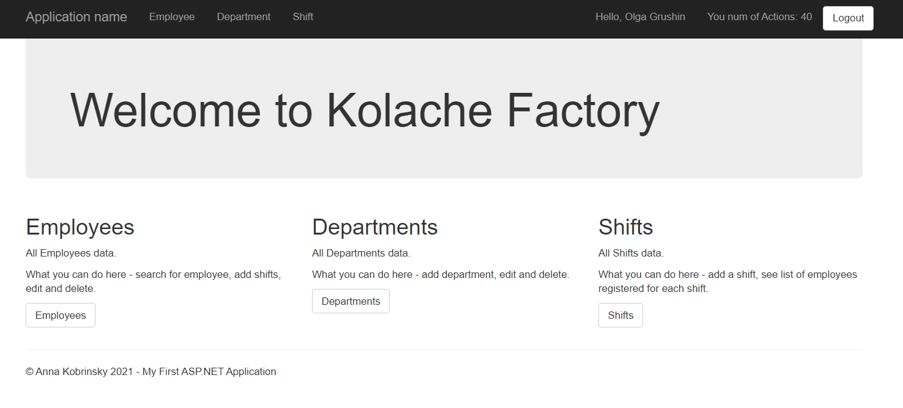

# Managment Factory App

An managment application with login authentication (manage and control the entire site), list of employees and employee search, departments
and shifts - developed using ASP.NET, EntityFramework and MySQL.

## Core Packages
1. Angular Router (for routing)
2. Angular Material (for styling)

## How To Run

* Open solution in Visual Studio 2019
* Set .Web project as Startup Project and build the project
* Run the application

## UI

### Login

### Home

### Employees

### Edit Employee

### Departments

### Shifts

